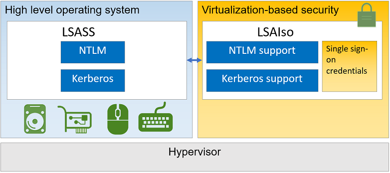

# Chapter 0.0 - LSASS Dumping

One of the most common techniques used by adversaries is LSASS dumping, blahblah

Local Security Authority (LSA) is protected subsystem that authenticates and logs users onto the local system. In previous versions of Windows (before Windows 10 and Server 2016), LSA stored secrets used by the operating system in its process memory. As discussed above, when hackers compromise operating system, they can get access to process memory leading to credential theft and lateral theft.

# CredentialGuard

Credential guard uses virtualization-based security and creates a new component LSA Isolated to store all secrets that the operating system cannot access directly so that even if hackers compromise the system, they cannot do credential theft. Once Credential guard is configured,  LSA process (LSASS) runs in the operating system, and additional instance of LSA (LSAIso – which stands for LSA Isolated) is created. LSA connects to LSA Isolated using RPC. This is to allow all of the standard calls to LSA to still succeed, offering backwards compatibility for services or applications that require direct communication with LSA.

# CredentialGuard - things to know

Credential Guard requirement

Operating System – Windows 10 Enterprise, Windows 10 Education, Windows Server 2016, and Windows 10 IoT Enterprise.

Credential Guard is supported for Hyper-V virtual machine.

Enabling Credential Guard on `domain controllers` is ***not supported***.

# Mimikatz/SharpKatz

https://github.com/gentilkiwi/

strings
lazysign
yara
threatcheck (clamav/MS Defender) folder exceptions (AMSI?)
KleenScan
IAT (pebear?)
DNSpy netpeek

Hexview/Visual Studio

NativeDump

