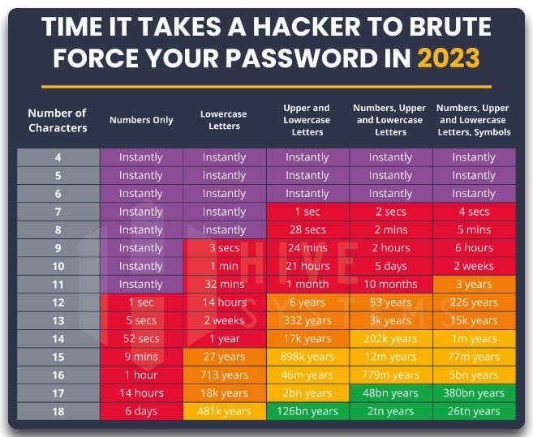

# Chapter 2.2 - Kerberoasting

>**Kerberoasting mitigations:** The best way to prevent adversaries from cracking kerberos tickets is by using very long and complex passwords. Service Accounts should have a minimum of **25 characters**, make sure to frequently **rotate** the passwords and adhere to the **least privilege** principle when assigning rights to the account (i.e. Don't add the account to Domain Admins just because it's easy). You can also consider using Group Managed Service Accounts (**GSMA**) or another third-party product such as a password vault.

The table below shows you the average time it would take to brute-force a password, keep in mind these numbers only reflect hard brute forcing, so not using password dictionaries or rainbox tables.



A Few useful **CLI** commands:

|command|Details|
|---|---|
|**net user SVC_SQL /domain**|*Query DC for user details.*|
|**net user SVC_SQL Password123!**|*Set the password of a domain user to Password123.*|
|**net user /add /domain /active:yes SVC_SQL Password123!**|*Add a user to the domain, enable the account and set the password.*|
|**net user SVC_SQL /domain /active:no**|*Disable (or enable) a domain account*|
|**net group "domain admins" SVC_SQL /ADD /DOMAIN**|*Add account to "Domain Admins" (or any other group).*|
|**setspn -T acme -Q \*/\***|*Enumerate all Service Principal Names (SPN), to find service accounts.*|
|**setspn -A SVC_SQL/dc.acme.local:12345 acme\SVC_sql**|*Create an SPN for an account.*|


And the same in **POWERSHELL**:

|command|Details|
|---|---|
|**$secpasswd = ConvertTo-SecureString -String "Password123" -AsPlainText -Force**|*Put the password in a variable.*|
|**New-ADuser -Name 'SVC_SQL' -GivenName 'SVC' -Surname 'SQL' -DisplayName 'SVC_SQL' -AccountPassword $secpasswd -enabled 1**|*Add a user to the domain, enable the account and set the password.*|

So now let's set up our lab environment by creating a kerberoastable account that has a weak password.

```
net user /add /domain /active:yes SVC_SQL Password123!
```
