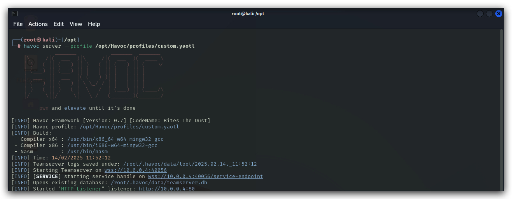
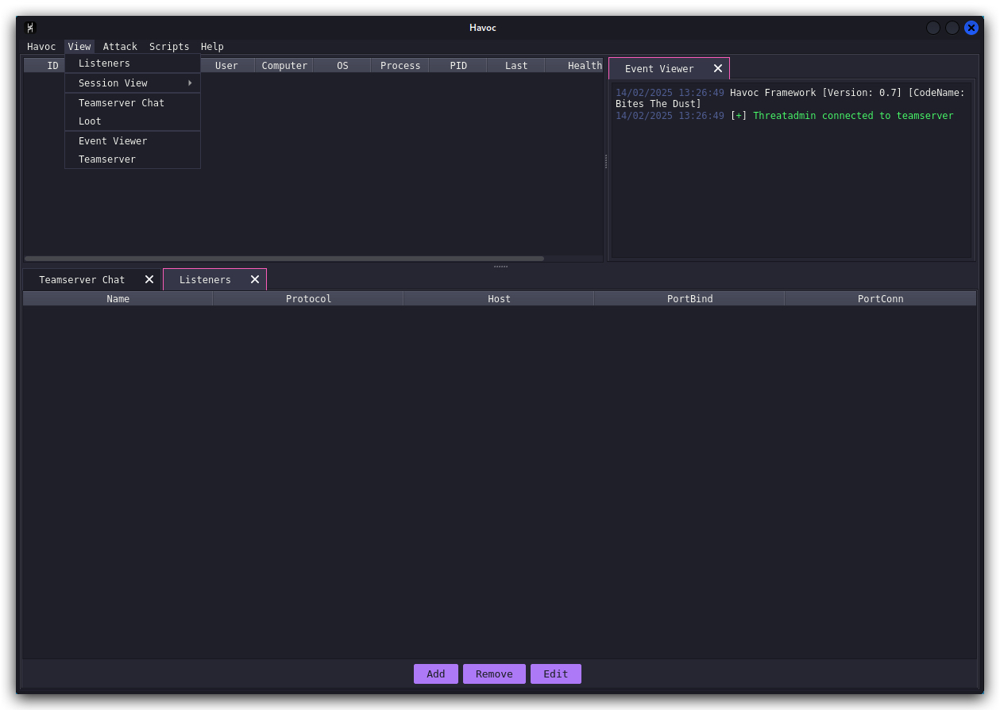

# Havoc C2

With a phletora of attack frameworks available (https://howto.thec2matrix.com), the most important requirement is *malleability/customizability*. Commonly known frameworks such as `metasploit`, `cobalt strike`, `Empire` (Sartkiller GUI), `Mythic C2` and `sliver` come to mind. In this training we'll be using a rather new, cobalt strike like framework called `Havoc C2`.

Attack frameworks typically all consist of the following 3 elements

1. ***Teamserver***
The central C2 server that receives C2 traffic from implants on its listeners (i.e. `LHOST` in metasploit), as well as management connections from the client.

2. ***Client***
This is the operater console that connects to the teamserver and allows the adversary to manage listeners, malleable profiles, payloads and implants.

3. ***Implant, beacon, demon, ...*** 
This is the actual malicious code that communicates back over a C2 channel to the teamserver, very often this is primarily a stager/loader (a tiny program that will download the actual malicious code and typically inject it in to memory of a current or remote process.)

Havoc C2 is the framework we will be using in this training, however the techniques we'll be using can be utilized in each of beforementioned frameworks.


> <https://github.com/HavocFramework/Havoc?tab=readme-ov-file>
> 
> On Kali we can simply install Havoc C2 with the following command (this is already done)
> 
```bash
apt install havoc
```

# Creating a custom profile
Let's have a look at the custom profile we have created for this team server. The profile will have the general settings such as users that can log in to the team server, user agents for HTTP/HTTPs listeners, and how our implants will behave.

> ***OPSEC HINT*** : Always customize your profiles as default profiles are almost often finger printed by AV/EDR.

```bash
sudo nano /opt/Havoc/profiles/custom.yaotl
```

This is the content of the custom profile:

```yaml
Teamserver {
    Host = "10.0.0.4"
    Port = 40056

    Build {
        Compiler64 = "/usr/bin/x86_64-w64-mingw32-gcc"
        Nasm = "/usr/bin/nasm"
    }
}

Operators {
    user "Threatadmin" {
        Password = "Threathunt25"
    }
}

# demon setting.

Demon {
    Sleep = 2
    Jitter = 20

    TrustXForwardedFor = false

    Injection {
        Spawn64 = "C:\\Windows\\System32\\Werfault.exe"
    }

    Binary {
        ReplaceStrings-x64 = {
            "demon.x64.dll": "",
            "This program cannot be run in DOS mode.": "",
        }
    }
}
```

# Running the teamserver


```bash
havoc server --profile /opt/Havoc/profiles/custom.yoatl
```

# Running the client


In your terminal open a new tab, then run the following command:


```code
havoc client
```
We can now log in to our teamserver using the user `Threatadmin` and the password whcih we defined in the custom Havoc C2 profile.


Let's start by setting up a listener:

<https://havocframework.com/docs/profiles>

In the Havoc GUI to to `view` and select listeners.



> ***OPSEC HINT*** : Always customize your listeners by using valid user agents, also by using HTTPs we make sure our connections are harder to inspect. This is a nice website to generate user agents strings: <https://useragents.io/parse/my-user-agent>

Here's a regular chrome user agent from your windows machine:
```yaml
Mozilla/5.0 (Windows NT 10.0; Win64; x64) AppleWebKit/537.36 (KHTML, like Gecko) Chrome/132.0.0.0 Safari/537.36
```
Let's add an HTTPs listener, click on `Add` and enter the listener configuration. Give the listener a name, select `Https` and past the user agent in the correct field. Click on `Save`

> Make sure you select the correct IP addres (host) for your machine! You can double check by running ifconfig.


