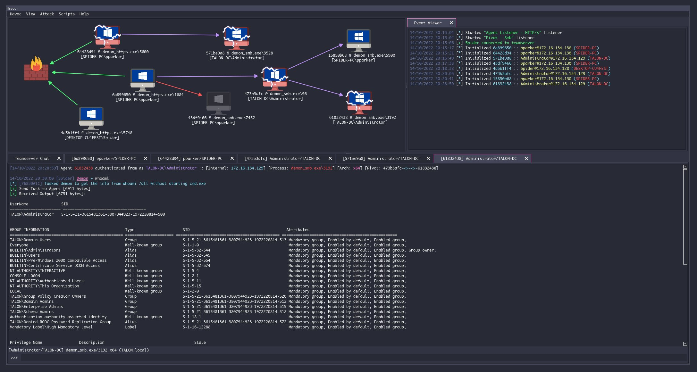

# Havoc C2

With a phletora of attack frameworks available (https://howto.thec2matrix.com), the most important requirement is *malleability/customizability*. Commonly known frameworks such as `metasploit`, `cobalt strike`, `Empire` and `sliver` come to mind. In this training we'll be using a rather new, cobalt strike like framework called `Havoc C2`.

Attack frameworks typically all consist of the following 3 elements

1. ***Teamserver***
The central C2 server that receives C2 traffic from implants on its listeners (i.e. `LHOST` in metasploit), as well as management connections from the client.

2. ***Client***
This is the operater console that connects to the teamserver and allows the adversary to manage listeners, malleable profiles, payloads and implants.

3. ***Implant, beacon, demon, ...*** 
This is the actual malicious code that communicates back over a C2 channel to the teamserver, very often this is primarily a stager/loader (a tiny program that will download the actual malicious code and typically inject it in to memory of a current or remote process.)

Havoc C2 is the framework we will be using in this training, however the techniques we'll be using can be utilized in each of beforementioned frameworks.



> https://github.com/HavocFramework/Havoc?tab=readme-ov-file
> 
> On Kali we can simply install Havoc C2 with the following command
> 
```code
apt install havoc
```

Running the teamserver (Profiles)

```code
havoc server --profile /opt/Havoc/profiles/custom.yoatl
```

Running the client

```code
havoc client
```

